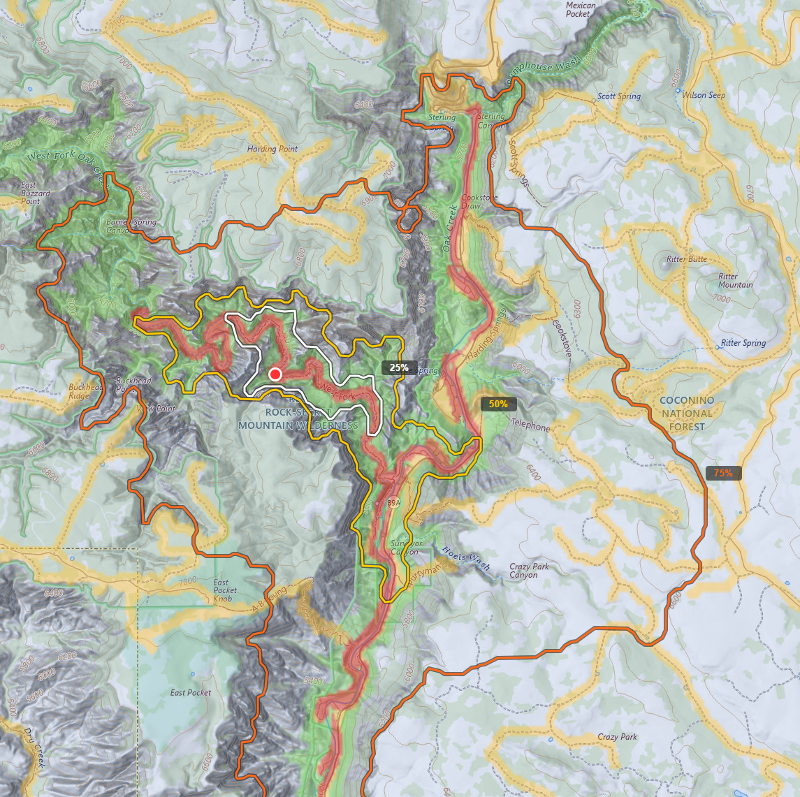

# WiSAR Decision Support Tool

**A Terrain-Aware Planning Aid for Wilderness Search and Rescue (v1.15)**

A web-based spatial analysis tool for Wilderness SAR operations. Instead of drawing simple Euclidean distance rings around an Initial Planning Point (IPP), it builds an anisotropic cost surface from elevation, land cover, hydrology, and OSM linear features, then traces contours of equal travel cost across real terrain, compressing against steep slopes, dense forest, and water barriers, while expanding along trails and valleys where a person can move easily. The cost surface drives both Terrain-Aware Range Rings (TARRs) at Koester find-distance percentiles and travel-time isochrones at user-specified time bands, with KML/GeoJSON exports and a write-back path to CalTopo for any SAR team's own maps.

**Live site:** [https://sar.weleber.net](https://sar.weleber.net)


---

## What this tool does

Given an IPP (the point where a lost person was last seen) and either a subject profile (hiker, child, dementia patient, etc.) or a travel speed, the tool:

1. **Downloads geospatial data** — elevation (USGS 3DEP), land cover (NLCD 2021), trails, roads, and power lines (OpenStreetMap), and hydrology (NHD). When public Overpass servers are unavailable, the pipeline falls through to a locally-maintained OSM cache covering AZ, CA, UT, NV, and NM.
2. **Builds a friction surface** — each 30m cell gets a cost multiplier based on land cover type, calibrated to off-trail speed literature (Imhof 1950). Trails, roads, and power line corridors are burned in at friction 1.0; water features from NHD and OSM act as high-impedance barriers.
3. **Computes anisotropic cost-distance** — Dijkstra's algorithm with per-edge Tobler's Hiking Function, cross-slope penalty, and 3D surface distance.
4. **Applies per-band calibration** — Coconino County calibration multipliers (M25, M50, M75) scale each percentile threshold independently to correct the nonlinear contraction of TARRs in rugged terrain.
5. **Computes terrain-attractor masks** — five Jacobs (2015) PDEN categories per pixel (stream-trail intersections, trails, low-elevation pockets, streams, high-elevation prominence). These drive within-envelope color in the heatmap so that planners see not just where a subject can reach, but where they statistically tend to be found.
6. **Generates output contours** — either Lost Person Behavior percentile contours (Koester 2008, "TARR Analysis mode") or time-based reachability contours at user-selected intervals ("Travel Time mode").

## Key features

- **Two analysis modes:** TARR Analysis (Koester-driven percentile envelope around an IPP) and Travel Time (reachability isochrones at a given travel speed).
- **Jacobs-driven heatmap:** within-envelope color reflects per-pixel terrain-attractor strength per Jacobs (2015), with stream-trail intersections rendering hottest (their strongest PDEN finding), trails next, then low-elevation pockets, streams, and high-elevation prominence. Renders at full opacity across the entire search area, including past the 75th percentile, where roughly 1-in-4 finds still occur.
- **28 subject categories** from Lost Person Behavior (Koester 2008) with eco-region and terrain selectors.
- **Per-band calibration** — profile-specific multipliers at each percentile threshold, validated against 360 historical subjects from 253 Coconino County missions.
- **CalTopo write-back, any team:** push TARR contours or travel-time isochrones to a CalTopo map as named Shape features. Coconino County SAR uses the team's stored credentials by default; other teams enter their own CalTopo API credentials in the UI and the tool passes them through without storing.
- **Resilient OSM data** — three live Overpass mirrors with automatic failover, plus a weekly-refreshed local cache fallback covering five Western states (~8.3 million features).
- **KML and GeoJSON export** of TARR or travel-time contours for CalTopo, Google Earth, TAK/CloudTAK, QGIS, and Avenza.
- **GeoTIFF downloads** of cost-distance, cost surface, and probability rasters.

## Calibration

Applying Euclidean-derived find-distance statistics (Koester 2008) as cost-distance thresholds systematically contracts TARR contours because terrain friction inflates effective travel distance. The contraction is nonlinear; outer contours are more compressed than inner ones as friction accumulates over longer paths.

The tool corrects this with per-band multipliers derived from Coconino County historical data. Profiles with n≥20 historical subjects receive profile-specific multipliers; remaining profiles use a global default (M25=1.05, M50=1.35, M75=1.80). Containment rates against historical find locations:

| Percentile | Nominal | Uncalibrated | Global per-band | Per-profile per-band |
|-----------|---------|--------------|-----------------|----------------------|
| 25th      | 25.0%   | 23.9%        | 27.9%           | 26.2%                |
| 50th      | 50.0%   | 41.1%        | 52.5%           | 50.0%                |
| 75th      | 75.0%   | 58.9%        | 76.8%           | 77.1%                |

Full validation details, including per-profile multiplier tables and per-profile containment rates, are available in the tool's Validation modal.

## Architecture

```
app/
├── server.py              Flask web server, API endpoints, PNG renderers
├── pipeline/              Analysis pipeline (modular package)
│   ├── __init__.py        Public API re-exports
│   ├── shared.py          Constants, utilities, bbox functions
│   ├── downloads.py       Data acquisition (DEM, NLCD, OSM, NHD) with caching
│   ├── osm_cache.py       Local OSM cache fallback (weekly Geofabrik refresh)
│   ├── cost_surface.py    Friction surface construction
│   ├── cost_distance.py   Dijkstra anisotropic cost-distance
│   ├── jacobs_masks.py    Terrain-attractor masks per Jacobs (2015)
│   └── outputs.py         Probability surfaces, TARR contours, isochrones
├── static/
│   ├── index.html         Single-page Leaflet.js frontend, modals, accordion UI
│   └── app.js             Application logic, calibration, CalTopo integration
└── tools/
    └── build_osm_cache.py Weekly OSM cache builder (memory-bounded Arrow streaming)
```

## Data sources

| Data | Source | Resolution |
|------|--------|-----------|
| Elevation | USGS 3DEP (1/3 arc-second) | 30m |
| Land cover | NLCD 2021 | 30m |
| Trails, roads, power lines | OpenStreetMap (Overpass: 3 mirrors + local cache fallback) | Vector |
| Hydrology | NHD (USGS MapServer) — waterbodies, area features, flowlines | Vector |
| Subject profiles | Koester (2008), via Ferguson (2013) IGT4SAR | Statistical |
| Terrain attractor weights | Jacobs (2015) PDEN findings | Per-feature |
| Calibration | Coconino County Sheriff's Office (360 subjects, 253 missions) | Per-profile |

## Methodology

The cost-distance computation combines four factors per cell transition:

- **Tobler's Hiking Function** (directional slope cost)
- **Land cover friction** (calibrated to Imhof 1950 off-trail speed reduction)
- **Cross-slope penalty** (lateral traversal difficulty)
- **3D surface distance** (Pythagorean with elevation change)

Friction multipliers range from 1.0 (trail/road/power line corridor) to 1.80 (evergreen forest) to 50.0 (water barrier). Power line rights-of-way are buffered at ~40m to represent cleared corridors. The full friction table and methodology are documented in the tool's Metadata modal.

Calibration multipliers are applied on the frontend before percentile distances are sent to the analysis pipeline. Each percentile (p25, p50, p75) receives its own multiplier, correcting the nonlinear contraction where terrain friction accumulates more over longer travel paths. The cost surface and cost-distance computation are unaffected; calibration adjusts only the statistical thresholds, not the terrain model.

The heatmap underneath the TARR contours uses a separate visualization layer driven by Matt Jacobs's (2015) PDEN framework. Each pixel is scored by the strongest applicable terrain attractor among five categories: stream-trail intersections (weight 1.00, Jacobs's strongest empirical finding at ~10x PDEN), trails and other linear corridors (0.55), low-elevation pockets (0.35), stream proximity (0.28), and high-elevation prominence (0.18). Scores are taken as the maximum across applicable masks (not summed), matching the structure of Jacobs's findings as observations of distinct cell categories rather than additive lifts. The stream mask uses NHD flowlines at Strahler order ≥3 rather than Jacobs's original ≥5 cutoff, because Strahler ≥5 flowlines are rare on the Colorado Plateau where most Coconino-area searches occur; the relaxed cutoff includes named perennial creeks like Sycamore Creek that are operationally significant but would otherwise be excluded. The heatmap renders at full opacity across the entire search area, including past the 75th percentile, where roughly 1-in-4 finds still occur per Koester's data and where Jacobs found that linear-feature PDEN actually increases with distance from the IPP.

Travel Time mode uses the same cost-distance pipeline but converts terrain-equivalent meters to hours using a user-supplied flat-ground speed, then contours at user-selected time intervals (2h, 4h, 6h, 8h, 10h, 12h). No Lost Person Behavior profile is required; this mode models physical capability rather than statistical find-distance likelihood.

## Tech stack

- **Backend:** Python 3.12, Flask, Gunicorn, Nginx
- **Frontend:** Leaflet.js, vanilla JavaScript (single-page app)
- **Geospatial:** rasterio, GDAL, shapely, geopandas, scipy, rasterstats, pyogrio
- **Server:** Ubuntu 24.04 on Linode (4GB RAM)

## References

- Danser, R.A., 2018. Applying least cost path analysis to search and rescue data [thesis]. University of Southern California.
- Doherty, P.J., Guo, Q., Doke, J., and Ferguson, D., 2014. An analysis of probability of area techniques for missing persons in Yosemite National Park. *Applied Geography*, 47, 99–110. doi:10.1016/j.apgeog.2013.11.001
- Ferguson, D., 2014. *Integrated Geospatial Tools for Search and Rescue (IGT4SAR)* [online]. GitHub. Available from: https://github.com/dferguso/IGT4SAR
- Imhof, E., 1950. *Gelände und Karte*. Erlenbach-Zürich: Eugen Rentsch Verlag.
- Jacobs, M., 2015. *Terrain Based Probability Models for SAR Executive Summary* [online]. Available from: https://mra.org/wp-content/uploads/2016/05/TerrainProbabilityModelsReport.pdf
- Koester, R.J., 2008. *Lost person behavior: a search and rescue guide on where to look — for land, air and water.* Charlottesville, VA: dbS Productions.
- Tobler, W.R., 1993. Non-isotropic geographic modeling. In: W.R. Tobler, ed. *Three presentations on geographical analysis and modeling.* Technical Report 93-1. Santa Barbara, CA: National Center for Geographic Information and Analysis.

## Author

**Jamie F. Weleber**
Coconino County Sheriff's Search & Rescue

## License

AGPL-3.0 — see [LICENSE](LICENSE) for details.
